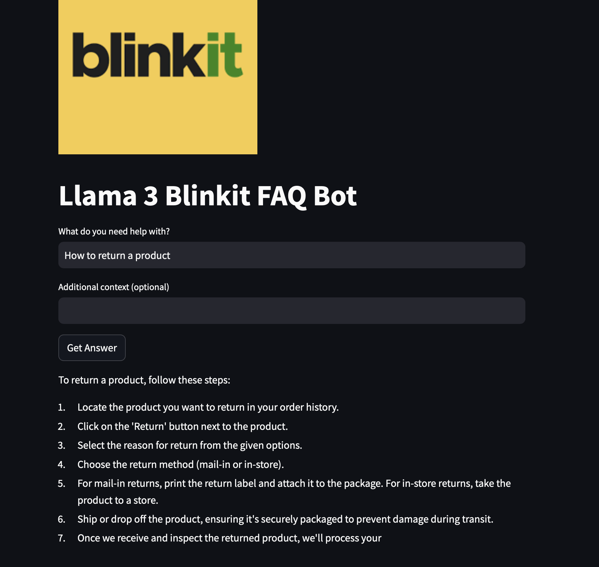
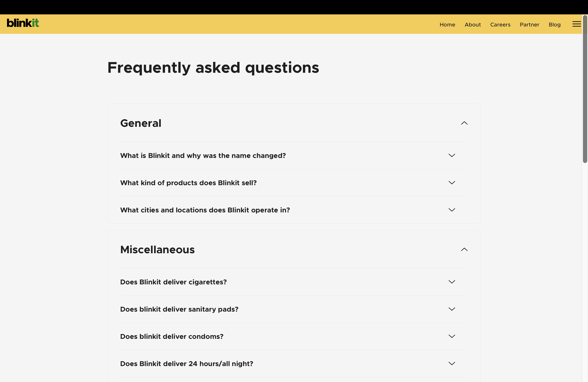

# Blinkit FAQ Bot

## Overview
This is a custom **FAQ chatbot** developed using the **Llama 3 model**. I fine-tuned the model with Blinkit's FAQ data, which I scraped myself. The chatbot is deployed using **Streamlit** and provides users with accurate and relevant responses to their queries.

### Features:
- Custom chatbot powered by Llama 3.
- Fine-tuned with real-world FAQ data scraped from Blinkit's website.
- Easy-to-use interface built with **Streamlit**.

## How to Run the Project Locally

1. Clone this repository:
    ```bash
    git clone https://github.com/yourusername/blinkit-faq-bot.git
    cd blinkit-faq-bot
    ```

2. Install required dependencies:
    ```bash
    pip install -r requirements.txt
    ```

3. Run the Streamlit app:
    ```bash
    streamlit run app.py
    ```

---

## Screenshots
Here’s a screenshot showing the **FAQ chatbot** answering a customer query.

  <!-- Image reference for FAQ bot screenshot -->

---

## About the Data
The **Blinkit FAQ** data was scraped from the Blinkit website using Python libraries like **BeautifulSoup** and **Requests**. I used this data to fine-tune the Llama 3 model, ensuring the chatbot gives highly relevant answers to common customer queries.

 
---
